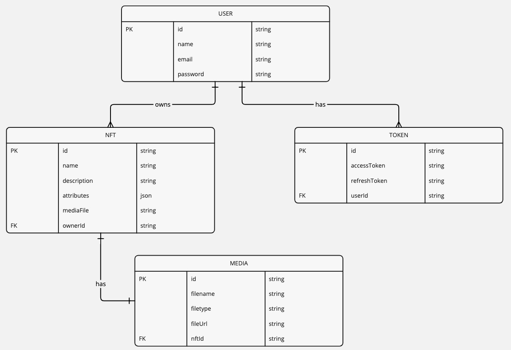

# NFT Marketplace API

This project provides a backend API for a digital marketplace focused on NFTs (Non-Fungible Tokens). The API supports user registration, login, JWT-based authentication, and the creation and retrieval of NFTs. It also supports the generation of access tokens, token refresh, and rate-limiting to ensure the security and efficiency of the platform.

## Features

- User Authentication: User registration, login, token generation, and token refresh
- NFT Management: Create, retrieve, and paginate NFTs with metadata and media files (images, videos, etc.)
- Rate Limiting: API rate-limiting to prevent abuse and ensure fairness
- JWT Authentication: Secure authentication via JWT access and refresh tokens
- File Upload: NFT media files (images/videos) can be uploaded during NFT creation

## ER Diagram

Here is the Entity-Relationship Diagram (ERD) for the project:



## Table of Contents

1. [Installation](#installation)
2. [Usage](#usage)
   - [User Registration](#user-registration)
   - [User Login](#user-login)
   - [Token Refresh](#token-refresh)
   - [NFT Creation](#nft-creation)
   - [Get NFTs](#get-nfts)
3. [API Endpoints](#api-endpoints)
4. [Tech Stack](#tech-stack)

## Installation

### Prerequisites

- Node.js: Ensure you have Node.js installed. You can download it from [here](https://nodejs.org)
- MongoDB: You'll need a MongoDB database (either local or hosted)

### Steps to Set Up the Project

1. Clone the repository:

```bash
git clone https://github.com/yourusername/nft-project.git
cd nft-project
```

2. Install dependencies:

```bash
npm install
```

3. Set up environment variables: Create a `.env` file in the root directory and add the following variables:

```env
JWT_SECRET=your_jwt_secret_key
MONGODB_URI=your_mongo_db_connection_string
PORT=5000  # You can change the port if needed
```

4. Start the server:

```bash
npm start
```

The API should now be running on `http://localhost:3000`.

## Usage

### User Registration

**Endpoint**: `POST /users/register`

**Request Body**:
```json
{
  "name": "John Doe",
  "email": "johndoe@example.com",
  "password": "P@ssw0rd"
}
```

**Response**:
```json
{
  "message": "User created successfully",
  "accessToken": "your_access_token",
  "refreshToken": "your_refresh_token",
  "user": {
    "name": "John Doe",
    "email": "johndoe@example.com"
  }
}
```

### User Login

**Endpoint**: `POST /users/login`

**Request Body**:
```json
{
  "email": "johndoe@example.com",
  "password": "P@ssw0rd"
}
```

**Response**:
```json
{
  "message": "Login successful",
  "accessToken": "your_access_token",
  "refreshToken": "your_refresh_token",
  "user": {
    "name": "John Doe",
    "email": "johndoe@example.com"
  }
}
```

### Token Refresh

**Endpoint**: `POST /users/refresh`

**Request Body**:
```json
{
  "refreshToken": "your_refresh_token"
}
```

**Response**:
```json
{
  "message": "Access token refreshed successfully",
  "newAccessToken": "your_new_access_token"
}
```

### NFT Creation

**Endpoint**: `POST /nfts/create`

**Request Body** (Multipart Form Data):
- name: The name of the NFT
- description: The description of the NFT
- attributes: JSON object with NFT attributes like rarity, color, etc.
- media: Media file (image/video) for the NFT

**Response**:
```json
{
  "message": "NFT created successfully",
  "nft": {
    "name": "CryptoPunk #1234",
    "description": "A rare CryptoPunk NFT",
    "attributes": {
      "rarity": "Legendary",
      "color": "green"
    },
    "media": {
      "filename": "image1234.png",
      "filetype": "image/png",
      "fileUrl": "/uploads/media/image1234.png"
    },
    "owner": "user_id"
  }
}
```

### Get NFTs

**Endpoint**: `GET /nfts/nfts`

**Query Parameters**:
- page: Page number for pagination (optional)
- limit: Number of NFTs per page (optional)

**Response**:
```json
{
  "nfts": [
    {
      "name": "CryptoPunk #1234",
      "description": "A rare CryptoPunk NFT",
      "attributes": {
        "rarity": "Legendary",
        "color": "green"
      },
      "media": {
        "filename": "image1234.png",
        "filetype": "image/png",
        "fileUrl": "/uploads/media/image1234.png"
      },
      "owner": "user_id"
    }
  ],
  "totalCount": 100,
  "currentPage": 1,
  "totalPages": 10
}
```

## API Endpoints

### User Endpoints
- `POST /users/register`: Register a new user
- `POST /users/login`: Login an existing user
- `POST /users/refresh`: Refresh the access token using a valid refresh token

### NFT Endpoints
- `POST /nfts/create`: Create a new NFT with metadata and media
- `GET /nfts/nfts`: Retrieve a paginated list of NFTs

## Tech Stack

- Node.js: JavaScript runtime for building the backend
- Express: Web framework for Node.js
- MongoDB: NoSQL database for storing user and NFT data
- Mongoose: ODM for interacting with MongoDB
- JWT: JSON Web Token for user authentication
- bcryptjs: Library for hashing and verifying passwords
- multer: Middleware for handling file uploads
- dotenv: Loads environment variables from .env file
- Swagger: For API documentation

